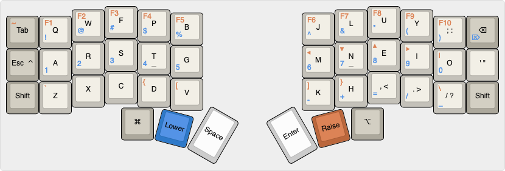

# Ergonomic keyboard layout design

[keyboard-layout-editor json](media/keyboard-layout.json)

## Motivation and Goals
Create an ergonomic keyboard layout design with the following goals:

1. Split design for ergonomic posture
2. Minimum pinky stress (no weird movements, no double key taps / holds)
3. Proper utilization of thumb fingers
4. Optimized for:
    1. Programming (mainly in `vim`)
    2. Writing in English
    3. Number crunching (accounting)
5. MacOS mainly
6. Not too different from standard keyboard in terms of:
    1. Placement of modifier keys such as `tab`, `shift`, and `backspace`
    2. Arrangement of numbers and symbols rows

## Board, switches, and key caps
* PCB - Corne ([crkbd](https://github.com/foostan/crkbd)) 3×6+3
* Switches - MX hot-swappable
    * Alpha keys (excluding pinky finger), space, and enter keys - Boba U4 tactile 68g - 26 total
    * Pinky alpha keys, and tap-able modifiers - Boba U4 tactile 62g - 10 total
    * Pinky and thumb hold-able modifiers - Boba gum 62g linear - 6 total
* Key caps - SA Profile, blanks
    * Q Row - R3 1U - 12 total
    * A Row - R2 1U - 12 total
    * Z Row - R1 1U - 12 total
    * Thumb Row
        * R1 1U - 4 total
        * R1 1.25U / 1.5U - 2 total

## Layout
Colemak Mod DH. 3 Layers - base, lower, raise

### Base layer
Optimized for writing. Standard Colemak-DH layout. Contains alpha keys, punctuation (dot and comma), quotes (single and double) as well as question
mark. Exclamation mark is on a layer. It's not great, but it's behind shift on a regular keyboard as well.
The only problem is that hyphen (`-`) is not there and is behind a layer.

#### Dual shift
Dual shift for proper capitalization by the opposite hand. Both shifts act as a shift on hold, and permanent caps lock
on double tap.

#### Escape key
Standalone caps lock key is removed in favor of a dual function key: `esc` on tap, MacOS control (`⌃`) on hold.

I don't like control key being there, because it limits the pinky shortcuts such as `Control+Q`, `Control+A`,
`Control+Z`, `Control+1`. Ideally I'd like to move it to a thumb key.

### Lower layer
Optimized for numbers and symbols. Contain standard number row on home row, and standard symbol row above the number
row. Have dedicated math symbols such as addition, subtraction, division, and equality.

### Raise layer
Optimized for programming. Contains `vim` style navigation on `mnei` (to retain `hjkl` muscle memory), as well as
allowing single hand navigation. Widely used symbols such as pipe (`|`), tilde (`~`), backslash (`\`) and backtick (\`) - are dedicated.
Support for curly braces (`{}`) and square braces (`[]`) on dedicated index fingers as they are used widely.

Tilde is on tab because many 60% keyboard put it there.

Backtick is on `Z` because there is a variation of the Apple Magic Keyboard where the backtick is between left shift and
`Z`.

## What's missing?
* Find a better place for `Control ⌃` key as it limits some pinky related shortcuts.
* Find a good combo for em-dash (`—`) and en-dash (`–`), as well as ellipsis (`…`). Maybe add Compose key?
    * Find a good combo for ≥ and ≤. Do I really need them? It could improve my writings.
* RGB controls
* Audio controls
* Dedicated `PgUp`, `PgDown`, `Home`, and `End` keys
* Dedicated `Hyper` key
* Dedicated mouse keys
* Find a way to have complex shortcuts which include all 3 modifiers - `Command+Option+Control` (might be solved with
    Hyper key)
* Allocate one thumb key for languages switching (to Russian and Hebrew) on double tap (similar to the MacOS Globe Key)
* `Command+Space` which is used in MacOS to open the launcher/Alfred/Raycast - is not that easy to press. Solution could
    be to change it to `Option+Space` which I now use for language switching.

## Acknowledgements
This layout was created for my needs. I'll continue to optimize it to suit my needs. It might not be suited for you.
Feel free to adopt and modify it according to your needs. If you find a better layout, I'd appreciate if you will share it
with me as well [contact[at]kudmitry.com](mailto:contact@kudmitry.com).
